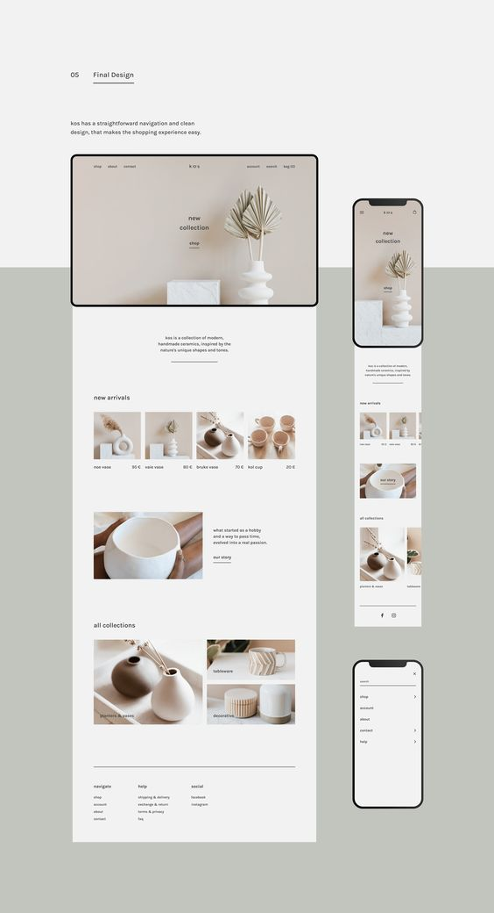

# HW1 Spec

### Sections

- Cover
    - 網頁名稱 (my photo album)
    - 下拉提示動畫 (scroll down)

- Photos
    - 相片預覽圖 (⼩圖): 滑鼠移動到上面，則圖片會變透明、放大、滑鼠游標變為pointer (可點按的提示)
    - 相片展⽰窗格 (⼤圖): 滑鼠移動到上面，則圖片會有陰影、放大、以及左右搖動的動畫

- Albums
    - 相簿選擇區塊: 滑鼠移動到上面，則圖片會變透明、放大、滑鼠游標變為pointer (可點按的提示)

### Additional Feature

- RWD

    - Photo section: 畫面縮小則四格圖片會變為兩格
    - Album section: 畫面縮小則第二個欄位會跑到下一行

### Referrence
- Template

- Websites
    - [multiple pics](https://codepen.io/bob-cat/pen/XdbEaa)
    - [text animation](https://tobiasahlin.com/moving-letters/)
    - [flexbox tutorial](https://nomichuang.medium.com/css-flex-%E5%B1%AC%E6%80%A7-ea2c1db1f925)
